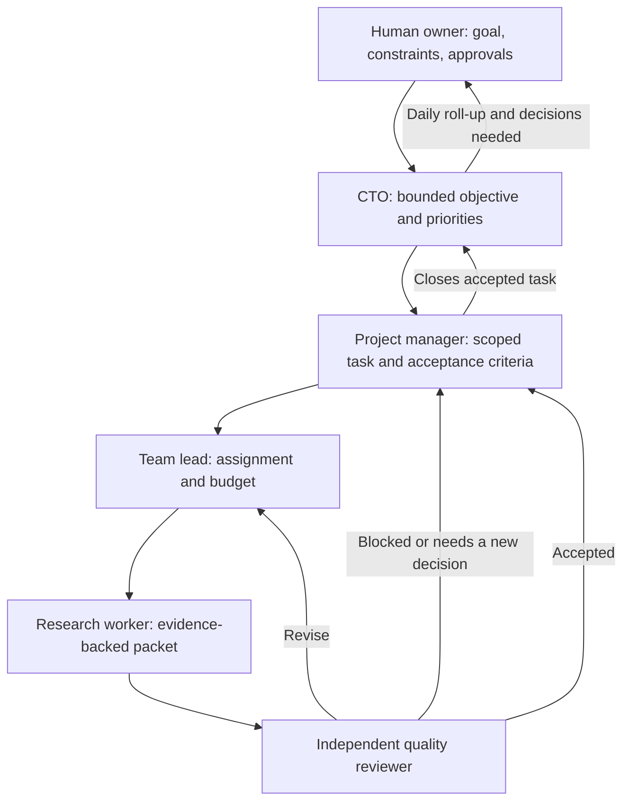

# Northstar Lab

Northstar Lab is an operations console for a research team that investigates real problems, checks evidence independently, and turns promising gaps into software-product opportunities. The long-term goal is a supervised team of AI agents whose work, decisions, costs, and daily progress are visible to the human owner.

**Current status:** The [live dashboard](https://northstar-lab-woad.vercel.app/) still offers a scripted workflow demo, and now also supports one **owner-operated Claude research worker**. The [Agent chats](https://northstar-lab-woad.vercel.app/#chats) feed labels scripted messages separately from real Claude drafts; [Worker usage](https://northstar-lab-woad.vercel.app/#usage) shows recorded calls. Claude runs only when the owner pairs and starts the local worker. A draft stops at **awaiting independent QA**—it is not an accepted finding. CTO, manager, lead, QA, and daily reports remain planned, not live model-backed agents.

## The team

| Role | Responsibility | Output |
| --- | --- | --- |
| [CTO orchestrator](agents/skills/cto-orchestrator/SKILL.md) | Sets bounded priorities, watches quality and cost, escalates decisions to the owner. | Executive decisions and a daily owner report. |
| [Project manager](agents/skills/project-manager/SKILL.md) | Turns an approved objective into tasks, acceptance criteria, owners, deadlines, and budgets. | Task plan and accepted/blocked status. |
| [Research team lead](agents/skills/research-team-lead/SKILL.md) | Assigns distinct work, manages handoffs and revisions, prevents duplicated effort. | Worker assignments and review-ready packets. |
| [Research worker](agents/skills/research-worker/SKILL.md) | Searches sources and produces a traceable answer to one question. | Evidence-backed research packet. |
| [Quality reviewer](agents/skills/quality-reviewer/SKILL.md) | Independently checks claims, sources, limitations, and acceptance criteria. | Accept, revise, or block decision. |

The owner is above the team: agents can recommend a direction, but the owner approves major changes in product scope, access, or spending. The shared [agent work protocol](agents/PROTOCOL.md) defines visible messages, reports, and quality gates.

## End-to-end workflow



1. **Set direction.** The owner states a problem area and constraints. The CTO proposes a bounded objective and checks that it fits the available time and money. A materially new direction goes back to the owner for approval.
2. **Plan the task.** The project manager writes a specific research question, expected deliverable, source/date bounds, acceptance criteria, deadline, owner, independent reviewer, and token/cost cap.
3. **Assign work.** The team lead splits the task only where separate workers can investigate distinct questions or methods. Each worker receives the smallest useful context and a stop condition; agents are not kept busy for its own sake.
4. **Research and record evidence.** A worker captures the search approach, source links or DOIs, publication dates, supporting results, contradictions, limitations, and open questions. For a ten-year literature review, the task specifies the exact date window. The worker labels hypotheses and does not claim novelty from an incomplete search.
5. **Hand off for independent review.** The worker submits a compact research packet and evidence links. A different agent checks pivotal sources against the original acceptance criteria. The worker cannot approve its own work.
6. **Resolve the review.** QA returns **accept**, **revise**, or **block**, with a reason. Revisions return through the lead to the worker; blocked work goes to the project manager or owner when a new decision or access is needed.
7. **Close or continue.** The project manager closes only accepted work. A promising gap becomes a candidate for further validation, not an automatic product decision. The CTO chooses the next bounded investigation or asks the owner to decide.
8. **Report daily.** Each active agent reports completed, in-progress, and blocked work; evidence and decisions; actual token/cost usage; and next actions. The CTO combines these into a short owner-facing summary at the owner's configured time and timezone. No activity is reported as no activity, never invented progress.

The [Agent chats view](https://northstar-lab-woad.vercel.app/#chats) shows task-linked, append-only messages with task and sender filters plus links to each [role skill](agents/skills/) and the [work protocol](agents/PROTOCOL.md). Scripted demo handoffs remain explicitly labeled. A Claude research run adds one real `finding` message and evidence links, labeled **QA pending**. It is a first-pass draft, not a verified research conclusion. Hidden model reasoning, credentials, and raw tool output are not published. Per-agent and CTO daily reports remain a future milestone.

## Research artifacts and product decisions

Accepted research packets should include a citation index, concise findings, limitations, conflicting evidence, and a proposed test of the identified gap. The GitHub repository will hold versioned, shareable findings and decision records. For papers or images that cannot legally be redistributed, store metadata and links rather than copies. A product idea moves forward only when evidence, user need, feasibility, and QA findings support a small validation experiment.

If a candidate survives that test, the CTO presents an evidence-backed **go / revise / stop** recommendation to the owner. With owner approval, the project manager can turn it into an MVP specification, engineering tasks, code review, deployment, and user-feedback measurements. This product-building phase will need its own engineering and product-validation skills; the five skills in this repository cover the research organization only. Feedback and failed assumptions return to the research backlog instead of being hidden behind a launch.

## Cost, safety, and operating rules

- The backend owns task state, allowed handoffs, message history, and measured token/cost usage. A model response alone cannot mark a task complete.
- Model calls occur for assigned work and necessary review, **not** for dashboard refreshes or idle chatter. Use short handoffs, stable role instructions, linked artifacts, and per-task limits.
- Stop at a task's time, source, token, or money cap and report what remains. Require owner approval before expanding scope or granting external write access.
- Add authenticated access before storing private research in the chat. Do not display API keys, private source text, or hidden reasoning in public UI messages.

## Worker routing and token accounting

The [Worker usage view](https://northstar-lab-woad.vercel.app/#usage) shows role assignments, Claude pairing/online status, and completed calls **generated by this workspace only**. It does not read account-wide subscription usage or reset times. Demo handoffs do not count. Interrupted or failed Claude calls may not return a final usage record, so provider totals can be higher than this ledger. The backend's read-only `GET /api/usage` returns per-provider and per-agent totals plus the latest 100 call records. The append-only PostgreSQL `usage_events` ledger is task-linked, workspace-scoped, and idempotent by provider/request ID. Browser workspace keys cannot submit real findings; the local worker uses a separate one-time pairing key stored only as a hash on Render. In-memory storage supports local development.

| Agent | Planned worker | Rationale |
| --- | --- | --- |
| CTO, project manager, team lead | Codex via OpenAI | Planning, coordination, and owner reporting |
| Research worker | Claude via Anthropic | Focused investigation and evidence packet |
| Quality reviewer | Codex via OpenAI | Independent cross-provider review |

The code includes normalizers for OpenAI and Claude response token fields. Cached input and reasoning output are shown as **subsets** of input/output, not extra tokens. Claude cache-write and cache-read tokens are included once in total input. The Claude worker submits measured usage after a successful run. Codex is still a planned route; there is no OpenAI account connection, automatic account rotation, or account-token entry in the dashboard.

## Run the Claude research worker

This is for the owner's own Claude Code subscription on an owner-operated Mac or private machine. It does **not** relay an OAuth token or API key to Render. [Claude Code supports `claude -p` non-interactive output and usage metadata](https://code.claude.com/docs/en/headless), and [Anthropic currently says this usage draws from subscription limits](https://support.claude.com/en/articles/15036540-use-the-claude-agent-sdk-with-your-claude-plan). [Anthropic warns against routing third-party traffic through subscription limits](https://support.claude.com/en/articles/13189465-log-in-to-your-claude-account); do not turn this personal companion into a hosted multi-user subscription proxy.

1. Install the [official Claude Code CLI](https://code.claude.com/docs/en/overview) and sign in with `claude auth login`. Do not use `--console` or set `ANTHROPIC_API_KEY` for this subscription worker. In `backend/`, run `npm run worker:claude -- --check` to verify login without a model call.
2. On the [Worker usage page](https://northstar-lab-woad.vercel.app/#usage), select **Pair local Claude**, then **Copy one-time worker key**. Keep it private. Rotating the key revokes an existing worker; the key is never saved in browser storage or GitHub.
3. From the repository's `backend/` directory on that same Mac, run:

   ```sh
   NORTHSTAR_WORKER_KEY="$(pbpaste)" npm run worker:claude
   ```

   The command watches for queued work while the computer and Terminal process stay running. Use `npm run worker:claude -- --once` with the same environment variable to process at most one task.
4. Add a narrowly scoped task on the dashboard and click **Run Claude**. The worker claims it, uses Claude Code with web search/fetch only, and submits a source-linked draft to Agent chats. The backend stores measured tokens and changes the task to **Awaiting QA**. No reviewer runs automatically yet.

Each run uses Sonnet, at most four model turns, an approximately $0.50 **list-price** budget guard (not a claim about subscription billing), a six-minute timeout, and instructions to check up to three primary sources. Claude has no file, shell, browser automation, or MCP tools for this pilot. Treat its citations and findings as unverified until QA checks them. The local worker key can authorize draft submission in this workspace; do not paste it into chat or share it. If the Mac sleeps, the worker stops; UptimeRobot does not run it.

## What works today versus what comes next

| Capability | Status |
| --- | --- |
| Dashboard and scripted PM → lead → worker → QA → revision → CTO walkthrough | Live demo |
| Task/event API on Render and frontend on Vercel | Live demo |
| UptimeRobot check of the API `/health` endpoint every five minutes | Configured |
| Dedicated [Agent chats view](https://northstar-lab-woad.vercel.app/#chats) with task/sender filters and links to skills | Live; scripted handoffs and labeled Claude drafts |
| PostgreSQL persistence of demo tasks, events, and agent messages | Connected on Render; the free database expires October 30, 2026 unless upgraded |
| [Worker usage view](https://northstar-lab-woad.vercel.app/#usage), Codex/Claude routing, and usage ledger | Live; Claude calls record usage after successful runs |
| Owner-operated Claude Code research worker with separate pairing key | Implemented; runs only while the owner starts and keeps the local process alive |
| Versioned role skills and shared message/report contract | Research worker instructions used by the pilot; other roles are still specifications |
| Independent QA, per-agent daily reports, CTO daily roll-up | Planned |
| Full ten-year literature review, accepted research, authenticated users | Planned |

The backend saves append-only `agent_messages`, task events, and measured `usage_events` for completed Claude runs. The frontend polls for workflow updates every 1.5 seconds and usage every 10 seconds. The next engineering milestones are owner authentication, independent QA, a safe artifact/research repository workflow, and durable per-agent/daily reports. A separate scheduler will generate reports at the owner's chosen time. **UptimeRobot is a health check and keep-alive, not a job scheduler or Claude worker.**

The owner wants subscription OAuth, **not API-key billing**. [OpenAI documents ChatGPT-plan usage for open-source/local apps](https://developers.openai.com/siwc/token-sharing-open-source), including a Codex app-server path; a paid or remotely hosted app must request access first. We do **not** proxy either account's subscription tokens through the public Render app. No OAuth credentials appear in the browser, GitHub, or agent messages. Do not use chat-share links or rotate subscription accounts to evade limits.

## Run locally

In one terminal:

```sh
cd backend
npm install
npm start
```

In another:

```sh
cd frontend
npm install
npm run dev
```

The frontend defaults to `http://localhost:8787`. Set `VITE_API_URL` for a different backend. Set `DATABASE_URL` on the backend for durable storage. The browser creates a random workspace key and stores it locally; use this release for demonstration data only.

Run the backend usage tests with `npm test` from `backend/`.

## Deployment

- Frontend: Vercel, root directory `frontend`, build command `npm run build`, output directory `dist`, `VITE_API_URL` set to the Render API URL.
- Backend: Render Node web service, root directory `backend`, build command `npm install`, start command `npm start`. Set `DATABASE_URL` to use PostgreSQL.
- Health endpoint: `GET` and `HEAD` on `https://northstar-lab-api.onrender.com/health` return HTTP 200 when the API is healthy. UptimeRobot checks this endpoint every five minutes.

Render's free web service can still restart, and its free PostgreSQL database has a limited lifetime. The keep-alive does not replace durable storage or guarantee production uptime.
