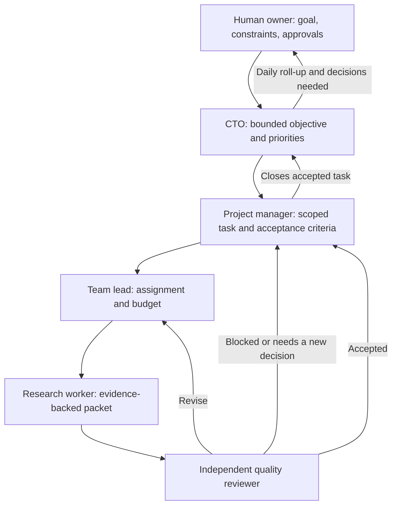

# Northstar Lab

Northstar Lab is an operations console for a research team that investigates real problems, checks evidence independently, and turns promising gaps into software-product opportunities. The long-term goal is a supervised team of AI agents whose work, decisions, costs, and daily progress are visible to the human owner.

**Current status:** The [live dashboard](https://northstar-lab-woad.vercel.app/), [Agent chats](https://northstar-lab-woad.vercel.app/#chats), and [Worker usage](https://northstar-lab-woad.vercel.app/#usage) views are a workflow demo. Its handoffs and messages are scripted, it performs no research, and it makes **zero AI model calls**. The role skills below define the intended behavior; model-backed agents and daily reports are not running yet.

## The team

| Role | Responsibility | Output |
| --- | --- | --- |
| [CTO orchestrator](agents/skills/cto-orchestrator/SKILL.md) | Sets bounded priorities, watches quality and cost, escalates decisions to the owner. | Executive decisions and a daily owner report. |
| [Project manager](agents/skills/project-manager/SKILL.md) | Turns an approved objective into tasks, acceptance criteria, owners, deadlines, and budgets. | Task plan and accepted/blocked status. |
| [Research team lead](agents/skills/research-team-lead/SKILL.md) | Assigns distinct work, manages handoffs and revisions, prevents duplicated effort. | Worker assignments and review-ready packets. |
| [Research worker](agents/skills/research-worker/SKILL.md) | Searches sources and produces a traceable answer to one question. | Evidence-backed research packet. |
| [Quality reviewer](agents/skills/quality-reviewer/SKILL.md) | Independently checks claims, sources, limitations, and acceptance criteria. | Accept, revise, or block decision. |

The owner is above the team: agents can recommend a direction, but the owner approves major changes in product scope, access, or spending. The shared [agent work protocol](agents/PROTOCOL.md) defines visible messages, reports, and quality gates.

## End-to-end workflow



1. **Set direction.** The owner states a problem area and constraints. The CTO proposes a bounded objective and checks that it fits the available time and money. A materially new direction goes back to the owner for approval.
2. **Plan the task.** The project manager writes a specific research question, expected deliverable, source/date bounds, acceptance criteria, deadline, owner, independent reviewer, and token/cost cap.
3. **Assign work.** The team lead splits the task only where separate workers can investigate distinct questions or methods. Each worker receives the smallest useful context and a stop condition; agents are not kept busy for its own sake.
4. **Research and record evidence.** A worker captures the search approach, source links or DOIs, publication dates, supporting results, contradictions, limitations, and open questions. For a ten-year literature review, the task specifies the exact date window. The worker labels hypotheses and does not claim novelty from an incomplete search.
5. **Hand off for independent review.** The worker submits a compact research packet and evidence links. A different agent checks pivotal sources against the original acceptance criteria. The worker cannot approve its own work.
6. **Resolve the review.** QA returns **accept**, **revise**, or **block**, with a reason. Revisions return through the lead to the worker; blocked work goes to the project manager or owner when a new decision or access is needed.
7. **Close or continue.** The project manager closes only accepted work. A promising gap becomes a candidate for further validation, not an automatic product decision. The CTO chooses the next bounded investigation or asks the owner to decide.
8. **Report daily.** Each active agent reports completed, in-progress, and blocked work; evidence and decisions; actual token/cost usage; and next actions. The CTO combines these into a short owner-facing summary at the owner's configured time and timezone. No activity is reported as no activity, never invented progress.

The [Agent chats view](https://northstar-lab-woad.vercel.app/#chats) currently shows task-linked, append-only **demo** messages for each assignment, handoff, revision, review, and report. It includes task and sender filters plus links to each [role skill](agents/skills/) and the [work protocol](agents/PROTOCOL.md). These are scripted messages, **not actual agent conversations or research findings**. When real agents are connected, the feed should show auditable conclusions and evidence—not hidden model reasoning, secrets, or long copied tool transcripts. Per-agent and CTO daily reports remain a future milestone.

## Research artifacts and product decisions

Accepted research packets should include a citation index, concise findings, limitations, conflicting evidence, and a proposed test of the identified gap. The GitHub repository will hold versioned, shareable findings and decision records. For papers or images that cannot legally be redistributed, store metadata and links rather than copies. A product idea moves forward only when evidence, user need, feasibility, and QA findings support a small validation experiment.

If a candidate survives that test, the CTO presents an evidence-backed **go / revise / stop** recommendation to the owner. With owner approval, the project manager can turn it into an MVP specification, engineering tasks, code review, deployment, and user-feedback measurements. This product-building phase will need its own engineering and product-validation skills; the five skills in this repository cover the research organization only. Feedback and failed assumptions return to the research backlog instead of being hidden behind a launch.

## Cost, safety, and operating rules

- The backend owns task state, allowed handoffs, message history, and measured token/cost usage. A model response alone cannot mark a task complete.
- Model calls occur for assigned work and necessary review, **not** for dashboard refreshes or idle chatter. Use short handoffs, stable role instructions, linked artifacts, and per-task limits.
- Stop at a task's time, source, token, or money cap and report what remains. Require owner approval before expanding scope or granting external write access.
- Add authenticated access before storing private research in the chat. Do not display API keys, private source text, or hidden reasoning in public UI messages.

## Worker routing and token accounting

The [Worker usage view](https://northstar-lab-woad.vercel.app/#usage) shows the proposed model assignment, current connection status, and usage **generated by this workspace only**. It does not read account-wide subscription usage or reset times. The current zeroes are real zeroes: demo handoffs do not call models, and neither subscription is connected. The backend's read-only `GET /api/usage` returns per-provider and per-agent totals plus the latest 100 call records. The append-only PostgreSQL `usage_events` ledger is task-linked, workspace-scoped, and idempotent by provider/request ID; there is no public browser endpoint for inventing usage records. In-memory storage is available for local development.

| Agent | Planned worker | Rationale |
| --- | --- | --- |
| CTO, project manager, team lead | Codex via OpenAI | Planning, coordination, and owner reporting |
| Research worker | Claude via Anthropic | Focused investigation and evidence packet |
| Quality reviewer | Codex via OpenAI | Independent cross-provider review |

The code includes normalizers for OpenAI and Claude response token fields. Cached input and reasoning output are shown as **subsets** of input/output, not extra tokens. Claude cache-write and cache-read tokens are included once in total input. The ledger is ready for an authorized worker process to record completed calls, but there is **no worker process connected yet**. A model selector, automatic account rotation, and “connect” buttons are intentionally absent while there is no secure, approved connection. A login link or subscription token pasted into the dashboard would not make that safe.

## What works today versus what comes next

| Capability | Status |
| --- | --- |
| Dashboard and scripted PM → lead → worker → QA → revision → CTO walkthrough | Live demo |
| Task/event API on Render and frontend on Vercel | Live demo |
| UptimeRobot check of the API `/health` endpoint every five minutes | Configured |
| Dedicated [Agent chats view](https://northstar-lab-woad.vercel.app/#chats) with task/sender filters and links to skills | Live scripted demo; no model calls |
| PostgreSQL persistence of demo tasks, events, and agent messages | Connected on Render; the free database expires October 30, 2026 unless upgraded |
| [Worker usage view](https://northstar-lab-woad.vercel.app/#usage), proposed Codex/Claude role routing, and usage ledger | Implemented; actual calls remain zero until a provider is connected |
| Versioned role skills and shared message/report contract | In this repository; **not connected to a model runtime** |
| Real agent conversation, per-agent daily reports, CTO daily roll-up | Planned |
| Source tools, real research, independent evidence checks, authenticated users | Planned |

The backend now saves append-only `agent_messages` alongside task events and is ready to save measured `usage_events`; the frontend polls for workflow updates every 1.5 seconds and usage every 10 seconds. The next engineering milestone is owner authentication, a permitted subscription connection, and durable per-agent/daily reports. A separate scheduler will generate reports at the owner's chosen time. **UptimeRobot is a health check and keep-alive, not a job scheduler.** Only after access controls and report storage are in place should model-backed agents begin research.

The owner wants subscription OAuth, **not API-key billing**. [OpenAI documents ChatGPT-plan usage for open-source/local apps](https://developers.openai.com/siwc/token-sharing-open-source), including a Codex app-server path; a paid or remotely hosted app must request access first. [Anthropic says Claude subscriptions are for subscribers' ordinary use of native apps and Claude Code](https://support.claude.com/en/articles/13189465-log-in-to-your-claude-account), and warns against routing third-party traffic against subscription limits. Its [Agent SDK notice](https://support.claude.com/en/articles/15036540-use-the-claude-agent-sdk-with-your-claude-plan) says subscription-backed SDK usage currently continues, but the rules may change. We therefore do **not** proxy either account's subscription tokens through the public Render app. A personal local companion or an explicitly approved hosted integration would need to provide the actual worker calls and recorded usage. No OAuth credentials should appear in the browser, GitHub, or agent messages. Do not use chat-share links or rotate subscription accounts to evade limits.

## Run locally

In one terminal:

```sh
cd backend
npm install
npm start
```

In another:

```sh
cd frontend
npm install
npm run dev
```

The frontend defaults to `http://localhost:8787`. Set `VITE_API_URL` for a different backend. Set `DATABASE_URL` on the backend for durable storage. The browser creates a random workspace key and stores it locally; use this release for demonstration data only.

Run the backend usage tests with `npm test` from `backend/`.

## Deployment

- Frontend: Vercel, root directory `frontend`, build command `npm run build`, output directory `dist`, `VITE_API_URL` set to the Render API URL.
- Backend: Render Node web service, root directory `backend`, build command `npm install`, start command `npm start`. Set `DATABASE_URL` to use PostgreSQL.
- Health endpoint: `GET` and `HEAD` on `https://northstar-lab-api.onrender.com/health` return HTTP 200 when the API is healthy. UptimeRobot checks this endpoint every five minutes.

Render's free web service can still restart, and its free PostgreSQL database has a limited lifetime. The keep-alive does not replace durable storage or guarantee production uptime.
