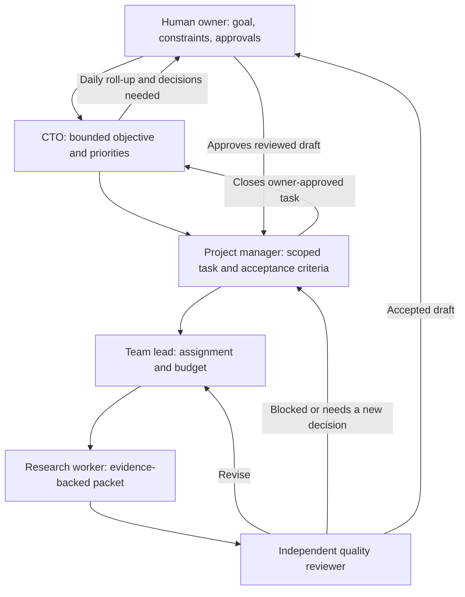

# Northstar Lab

Northstar Lab is an operations console for a research team that investigates real problems, checks evidence independently, and turns promising gaps into software-product opportunities. The long-term goal is a supervised team of AI agents whose work, decisions, costs, and daily progress are visible to the human owner.

**Current status:** The [live dashboard](https://northstar-lab-woad.vercel.app/) offers a scripted demo and an optional real five-role workflow on the owner's local Claude subscription. [Agent chats](https://northstar-lab-woad.vercel.app/#chats) has task threads and direct messages to all five roles. [Approval inbox](https://northstar-lab-woad.vercel.app/#approvals) holds QA-accepted drafts for the owner's decision. [Worker usage](https://northstar-lab-woad.vercel.app/#usage) records completed calls by role. [Alerts & reports](https://northstar-lab-woad.vercel.app/#reports) shows blocked work and a saved 6:00 PM IST daily snapshot. QA is a separate source-checking call on the **same Claude subscription**, not cross-provider independence. GitHub owner login and per-agent daily narrative reports are not live yet. Claude runs only while the owner-operated worker process and computer stay awake.

## The team

| Role | Responsibility | Output |
| --- | --- | --- |
| [CTO orchestrator](agents/skills/cto-orchestrator/SKILL.md) | Sets bounded priorities, watches quality and cost, escalates decisions to the owner. | Executive decisions and a daily owner report. |
| [Project manager](agents/skills/project-manager/SKILL.md) | Turns an approved objective into tasks, acceptance criteria, owners, deadlines, and budgets. | Task plan and accepted/blocked status. |
| [Research team lead](agents/skills/research-team-lead/SKILL.md) | Assigns distinct work, manages handoffs and revisions, prevents duplicated effort. | Worker assignments and review-ready packets. |
| [Research worker](agents/skills/research-worker/SKILL.md) | Searches sources and produces a traceable answer to one question. | Evidence-backed research packet. |
| [Quality reviewer](agents/skills/quality-reviewer/SKILL.md) | Independently checks claims, sources, limitations, and acceptance criteria. | Accept, revise, or block decision. |

The owner is above the team: agents can recommend a direction, but the owner approves major changes in product scope, access, or spending. The shared [agent work protocol](agents/PROTOCOL.md) defines visible messages, reports, and quality gates.

## End-to-end workflow



1. **Set direction.** The owner states a problem area and constraints. The CTO proposes a bounded objective and checks that it fits the available time and money. A materially new direction goes back to the owner for approval.
2. **Plan the task.** The project manager writes a specific research question, expected deliverable, source/date bounds, acceptance criteria, deadline, owner, independent reviewer, and token/cost cap.
3. **Assign work.** The team lead splits the task only where separate workers can investigate distinct questions or methods. Each worker receives the smallest useful context and a stop condition; agents are not kept busy for its own sake.
4. **Research and record evidence.** A worker captures the search approach, source links or DOIs, publication dates, supporting results, contradictions, limitations, and open questions. For a ten-year literature review, the task specifies the exact date window. The worker labels hypotheses and does not claim novelty from an incomplete search.
5. **Hand off for independent review.** The worker submits a compact research packet and evidence links. A different agent checks pivotal sources against the original acceptance criteria. The worker cannot approve its own work.
6. **Resolve the review.** QA returns **accept**, **revise**, or **block**, with a reason. Revisions return through the lead to the worker; blocked work goes to the project manager or owner when a new decision or access is needed.
7. **Close or continue.** The project manager closes only accepted work. A promising gap becomes a candidate for further validation, not an automatic product decision. The CTO chooses the next bounded investigation or asks the owner to decide.
8. **Report daily.** Each active agent reports completed, in-progress, and blocked work; evidence and decisions; actual token/cost usage; and next actions. The CTO combines these into a short owner-facing summary at the owner's configured time and timezone. No activity is reported as no activity, never invented progress.

The [Agent chats view](https://northstar-lab-woad.vercel.app/#chats) has task threads and direct-message views, backed by task-linked, append-only messages. The owner can address any of the five agents individually; direct answers do not change a formal verdict. **Run full team** on a queued task starts PM planning, lead assignment, research, automatic QA when sources exist, owner approval, PM closeout, and a CTO summary. Every role is a separate measured Claude call with a visible handoff. A source-free run becomes `research_blocked` and appears in [Alerts & reports](https://northstar-lab-woad.vercel.app/#reports), not the QA queue. QA publishes `ACCEPT`, `REVISE`, or `BLOCK` with checked links; `ACCEPT` goes to the [Approval inbox](https://northstar-lab-woad.vercel.app/#approvals), where an explicit browser-workspace decision approves it or requests revision. Revisions currently require a manual retry; they do not loop automatically through the lead. The local worker key cannot make the owner decision. Until GitHub login is enabled, protect the browser workspace key and do not use the pilot for private material. Scripted demo handoffs remain labeled. Hidden reasoning, credentials, and raw tool output are not published. The CTO task summary is real after an approved full-team task; an agent-written daily roll-up remains future work.

## Research artifacts and product decisions

The first bounded desk review is [2024–2026 OSS newcomer onboarding: preliminary evidence and a testable MVP hypothesis](research/2024-2026-oss-onboarding-preliminary.md). It is **not** an agent-team result or a QA-approved build decision; the live two-year task remains pending while the local Claude worker is stopped after a limit error.

Accepted research packets should include a citation index, concise findings, limitations, conflicting evidence, and a proposed test of the identified gap. The GitHub repository will hold versioned, shareable findings and decision records. For papers or images that cannot legally be redistributed, store metadata and links rather than copies. A product idea moves forward only when evidence, user need, feasibility, and QA findings support a small validation experiment.

If a candidate survives that test, the CTO presents an evidence-backed **go / revise / stop** recommendation to the owner. With owner approval, the project manager can turn it into an MVP specification, engineering tasks, code review, deployment, and user-feedback measurements. This product-building phase will need its own engineering and product-validation skills; the five skills in this repository cover the research organization only. Feedback and failed assumptions return to the research backlog instead of being hidden behind a launch.

## Cost, safety, and operating rules

- The backend owns task state, allowed handoffs, message history, and measured token/cost usage. A model response alone cannot mark a task complete.
- Model calls occur for assigned work and necessary review, **not** for dashboard refreshes or idle chatter. Use short handoffs, stable role instructions, linked artifacts, and per-task limits.
- Stop at a task's time, source, token, or money cap and report what remains. Require owner approval before expanding scope or granting external write access.
- Add authenticated access before storing private research in the chat. Do not display API keys, private source text, or hidden reasoning in public UI messages.

## Worker routing and token accounting

The [Worker usage view](https://northstar-lab-woad.vercel.app/#usage) shows role assignments, Claude pairing/online status, and completed calls **generated by this workspace only**. It does not read account-wide subscription usage or reset times. Demo handoffs do not count. Interrupted or failed Claude calls may not return a final usage record, so provider totals can be higher than this ledger. The backend's read-only `GET /api/usage` returns per-provider and per-agent totals plus the latest 100 call records. The append-only PostgreSQL `usage_events` ledger is task-linked, workspace-scoped, and idempotent by provider/request ID. Browser workspace keys cannot submit real findings; the local worker uses a separate one-time pairing key stored only as a hash on Render. In-memory storage supports local development.

| Agent | Current worker | Rationale |
| --- | --- | --- |
| CTO, project manager, team lead | Claude via Anthropic | Separate local calls for planning, coordination, and owner reporting |
| Research worker | Claude via Anthropic | Focused investigation and evidence packet |
| Quality reviewer | Claude via Anthropic | Separate invocation and source-checking context; not cross-provider QA |

The code includes normalizers for OpenAI and Claude response token fields. Cached input and reasoning output are shown as **subsets** of input/output, not extra tokens. Claude cache-write and cache-read tokens are included once in total input. The Claude worker submits measured usage after a successful run. Codex is not connected as a worker; there is no OpenAI account connection, automatic account rotation, or account-token entry in the dashboard.

## Persistent context and owner chat

In [Agent chats](https://northstar-lab-woad.vercel.app/#chats), the owner can edit the **project goal** and **memory notes** and message any role about a selected task. A question is saved immediately, queued if the local worker is offline, and answered when that worker runs. Task threads include planning, assignment, research, review, owner decisions, and closeout; direct-message views show each agent's one-to-one owner conversation. Older messages remain in PostgreSQL beyond the dashboard's latest-200 display. Chat answers are not QA-approved findings.

Each Claude research run or chat answer receives the saved goal and notes, current task title/brief/status, up to 12 recent real messages on that task, and five recent real cross-task work messages. Message excerpts are capped at 700 characters apiece. **Formal QA is different:** it receives only the task brief, latest research draft, and its evidence links in a fresh model call, without the research chat history. The full PostgreSQL ledger persists beyond those bounded context packets. Important long-lived decisions should be put in memory notes. No hidden reasoning or OAuth credential is stored in chat.

## Run the Claude research worker

This is for the owner's own Claude Code subscription on an owner-operated Mac or private machine. It does **not** relay an OAuth token or API key to Render. [Claude Code supports `claude -p` non-interactive output and usage metadata](https://code.claude.com/docs/en/headless), and [Anthropic currently says this usage draws from subscription limits](https://support.claude.com/en/articles/15036540-use-the-claude-agent-sdk-with-your-claude-plan). [Anthropic warns against routing third-party traffic through subscription limits](https://support.claude.com/en/articles/13189465-log-in-to-your-claude-account); do not turn this personal companion into a hosted multi-user subscription proxy.

1. Install the [official Claude Code CLI](https://code.claude.com/docs/en/overview) and sign in with `claude auth login`. Do not use `--console` or set `ANTHROPIC_API_KEY` for this subscription worker. In `backend/`, run `npm run worker:claude -- --check` to verify login without a model call.
2. On the [Worker usage page](https://northstar-lab-woad.vercel.app/#usage), select **Pair local Claude**, then **Copy one-time worker key**. Keep it private. Rotating the key revokes an existing worker; the key is never saved in browser storage or GitHub.
3. From the repository's `backend/` directory on that same Mac, run:

   ```sh
   NORTHSTAR_WORKER_KEY="$(pbpaste)" npm run worker:claude
   ```

   The command watches for queued work while the computer and Terminal process stay running. Use `npm run worker:claude -- --once` with the same environment variable to process at most one queued item (review, question, or research task). After updating the repository, **restart any already-running worker process** so it can claim QA jobs; the paired key does not need rotating.
4. Add a narrowly scoped task on the dashboard and click **Run full team** for PM → lead → research → QA → owner → PM → CTO, or **Research only** to save management calls. The worker uses explicitly approved WebSearch/WebFetch only and submits a source-linked draft. The backend automatically queues the separate reviewer pass **only when a source is present**. A source-free draft becomes a blocker you can read and retry. Read QA's `ACCEPT`, `REVISE`, or `BLOCK` verdict in [Approval inbox](https://northstar-lab-woad.vercel.app/#approvals). An accepted draft still needs the owner's approval; a rejected or blocked draft can be re-queued for research. Direct questions to any role use the same local process but do not change the formal QA status.

Research and QA runs use Sonnet, at most four model turns and an approximately $0.50 **list-price** budget guard each (not a claim about subscription billing), plus a six-minute timeout. Direct chats allow three turns and a $0.30 guard. Claude has no file, shell, browser automation, or MCP tools in this pilot. The reviewer can still miss errors; treat citations as unverified until checked by a person for consequential decisions. The local worker key can authorize draft and review submission in this workspace; do not paste it into chat or share it. If the Mac sleeps, the worker stops; UptimeRobot does not run it.

## What works today versus what comes next

| Capability | Status |
| --- | --- |
| Dashboard and scripted PM → lead → worker → QA → revision → CTO walkthrough | Live demo |
| Task/event API on Render and frontend on Vercel | Live |
| UptimeRobot check of the API `/health` endpoint every five minutes | Configured |
| [Agent chats](https://northstar-lab-woad.vercel.app/#chats) with task threads and direct owner-to-agent messages | Live for all five roles through separate local Claude calls |
| [Approval inbox](https://northstar-lab-woad.vercel.app/#approvals) and review state machine | Live; separate Claude QA verdict, then explicit owner approval/revision |
| PostgreSQL persistence of demo tasks, events, and agent messages | Connected on Render; the free database expires October 30, 2026 unless upgraded |
| [Worker usage view](https://northstar-lab-woad.vercel.app/#usage) and usage ledger | Live; Claude calls record usage after successful runs; Codex not connected |
| Owner-operated Claude Code research worker with separate pairing key | Implemented; runs only while the owner starts and keeps the local process alive |
| Durable project goal, memory notes, and bounded context for Claude runs | Implemented; full message history is retained, but only selected recent excerpts enter each model call |
| [Alerts & reports](https://northstar-lab-woad.vercel.app/#reports) | Live stuck/decision alerts and a saved, factual daily snapshot at approximately 6:00 PM IST |
| Telegram alert/report delivery | Configured for the owner's private bot; a test stuck alert was delivered; first daily report awaits 6:00 PM IST |
| Versioned role skills and shared message/report contract | All five role instructions loaded by the local worker |
| Model-backed task CTO summary | Queued after owner approval of a full-team task; no completed live task yet |
| Cross-provider QA and per-agent daily narrative reports | Planned |
| Full ten-year literature review, user-demand validation, authenticated users | Planned |

The backend saves append-only `agent_messages`, task events, measured `usage_events`, and daily report snapshots for completed Claude runs. The dashboard puts task creation and Claude setup first and labels real work separately from demos. While the tab is visible, the frontend polls workflow updates every 1.5 seconds and usage/reports every 30 seconds; background tabs stop polling and refresh when reopened. The next engineering milestones are GitHub owner authentication restricted to `allaboutaryan`, cross-provider QA if an approved route becomes available, explicit user-demand validation, a safe artifact/research repository workflow, and per-agent narrative reporting. A lightweight server timer checks for the 6:00 PM IST report every minute; the `/health` ping also checks it. This is **best-effort on Render Free**: sleep, restart, or an outage can delay it. UptimeRobot is a health check and keep-alive, **not a guaranteed scheduler or Claude worker**.

## Telegram notifications and daily reports

[Alerts & reports](https://northstar-lab-woad.vercel.app/#reports) is available without Telegram. It flags source-free research, failed or blocked research/QA, decisions awaiting the owner, work queued while the local Claude worker is offline for ten minutes, and expired worker leases. The report is created once per India calendar day at or after 6:00 PM IST. It counts only stored non-demo messages and measured worker calls for that day up to 6:00 PM; an idle day explicitly shows no agent activity. The report is a factual system summary, **not** a fabricated CTO/agent narrative.

To send those alerts and the daily report to one private Telegram chat:

1. Create your own private bot with [Telegram's official BotFather](https://core.telegram.org/bots/features#botfather), then open its chat and send `/start`. Keep its token private.
2. Get that chat's numeric ID using the official Bot API's [`getUpdates`](https://core.telegram.org/bots/api#getupdates) after sending `/start`. Do not paste the token or chat ID into this repository, a chat message, or the browser dashboard.
3. In [Alerts & reports](https://northstar-lab-woad.vercel.app/#reports), click **Copy workspace ID**. In the Render API service's private environment settings, add `NORTHSTAR_TELEGRAM_BOT_TOKEN`, `NORTHSTAR_TELEGRAM_CHAT_ID`, and `NORTHSTAR_TELEGRAM_WORKSPACE_ID`. The workspace ID is the copied value. Do not set these as Vercel frontend variables.
4. Redeploy the Render API service, then check that the dashboard says **Telegram configured**. That means the settings exist; it does not prove delivery. A test alert or the first daily report is the end-to-end confirmation.

The backend sends through Telegram's official [`sendMessage`](https://core.telegram.org/bots/api#sendmessage) endpoint. Repeated checks use a persisted delivery key to avoid ordinary duplicates and retry a failed attempt after five minutes. It is best-effort, not exactly-once delivery. Only the configured workspace is eligible; the phone number previously provided is not used or stored. No paid Render cron service has been created.

The owner wants subscription OAuth, **not API-key billing**. GitHub sign-in below authenticates the *owner of this dashboard*; it is not a Claude or Codex subscription bridge. [OpenAI documents ChatGPT-plan usage for open-source/local apps](https://developers.openai.com/siwc/token-sharing-open-source), including a Codex app-server path; a paid or remotely hosted app must request access first. We do **not** proxy either account's subscription tokens through the public Render app. No Claude/Codex OAuth credentials appear in the browser, GitHub, or agent messages. Do not use chat-share links or rotate subscription accounts to evade limits.

## Owner sign-in

The backend includes a GitHub OAuth sign-in gate restricted to the numeric GitHub ID of `allaboutaryan` (not merely the typed username). It requests no repository scope. The GitHub token is used only on the backend to check identity; a signed, HttpOnly, Secure, 12-hour cookie is issued for the Vercel site. Vercel rewrites `/api/*` and `/auth/*` to Render, keeping the cookie same-origin in the browser. Until the OAuth app and private Render settings below are installed, **the old random browser workspace key remains active**; do not store private work in that mode.

1. Register a GitHub OAuth App owned by `allaboutaryan`, with homepage `https://northstar-lab-woad.vercel.app/` and callback `https://northstar-lab-woad.vercel.app/auth/github/callback`.
2. Add `NORTHSTAR_GITHUB_CLIENT_ID`, `NORTHSTAR_GITHUB_CLIENT_SECRET`, `NORTHSTAR_SESSION_SECRET` (a random 32+-character value), and `NORTHSTAR_OWNER_WORKSPACE_ID` (the current dashboard workspace ID) as **private Render backend environment variables**. Never add them to Vercel's frontend variables or this repo. Deploy Render once after all four are set.
3. Open the dashboard, choose **Continue with GitHub**, and verify that `allaboutaryan` can sign in and other GitHub accounts cannot. Once enabled, the backend rejects the old browser workspace key for owner routes. The separate local Claude worker key continues to work.

The current free PostgreSQL database has a time limit and no automatic backup. Owner sign-in does not make the data durable or the local Claude worker always-on.

## Run locally

In one terminal:

```sh
cd backend
npm install
npm start
```

In another:

```sh
cd frontend
npm install
npm run dev
```

The local frontend defaults to `http://localhost:8787`; set `VITE_API_URL` for a different local backend. Production calls use the same-origin Vercel rewrites in `frontend/vercel.json`. Set `DATABASE_URL` on the backend for PostgreSQL storage. Without the GitHub OAuth settings, the browser creates a random workspace key and stores it locally; use that mode for demonstration data only.

Run the backend usage tests with `npm test` from `backend/`.

## Deployment

- Frontend: Vercel, root directory `frontend`, build command `npm run build`, output directory `dist`; `vercel.json` rewrites `/api` and `/auth` to Render. `VITE_API_URL` is used only for local development.
- Backend: Render Node web service, root directory `backend`, build command `npm install`, start command `npm start`. Set `DATABASE_URL` to use PostgreSQL.
- Health endpoint: `GET` and `HEAD` on `https://northstar-lab-api.onrender.com/health` return HTTP 200 when the API is healthy. UptimeRobot checks this endpoint every five minutes.

Render's free web service can still restart, and its free PostgreSQL database has a limited lifetime. The keep-alive does not replace durable storage or guarantee production uptime.
